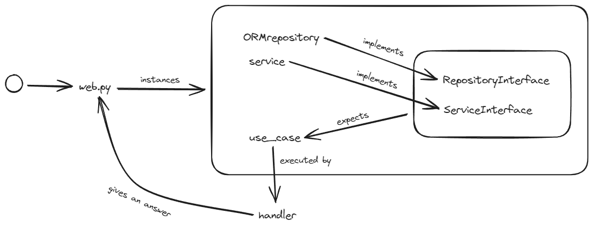

# Hexagon generator for FastApi

This project aims to create an hexagon component in the context of **hexagonal architecture**. So, in `hexagon.py` you will a script file to generate code. Just run:

- `python code_generator.py PascalCaseName snake_case_name`

It will generate for you almost everything for your endpoint :D (check the things marked with `# TODO:`)

> Code once enjoy always

### Running with docker

- `docker build -t empty-fastapy-hexagonal .`
- `docker run -it --rm -p 8000:8000 -v .:/app empty-fastapy-hexagonal`

### Code generated




---

##### Add alembic to fastapi
1. desde /backend correr `alembic init app/alembic`
2. ir a `app/alembic/env.py` y agregar el siguiente código, para traer la DATABASE_URL de variables de entorno
```python
# this is the Alembic Config object, which provides
# access to the values within the .ini file in use.
import os
from src.common.database_connection import Base

DATABASE_URL = os.getenv("DATABASE_URL")

config = context.config
config.set_main_option('sqlalchemy.url', DATABASE_URL)


target_metadata = Base.metadata

```
3. Para poder correr las migraciones hay que importar los modelos al archivo env.py de alembic
4. donde esté nuestro alembic.ini correr `alembic revision --autogenerate -m "Initial migration"` para generar las migraciones
5. correr `alembic upgrade head` para aplicar las migraciones
