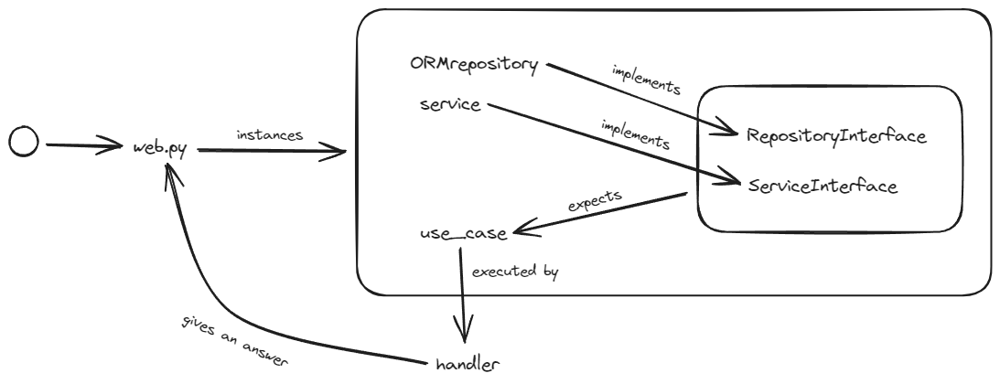

# Hexagon generator for FastApi

This project aims to create an hexagon component in the context of **hexagonal architecture**. So, in `hexagon.py` you will a script file to generate code. Just run:

- `python hexagon.py CapitalizedName snake_case_name`

It will generate for you almost everything for your endpoint :D

> Code once enjoy always

### Running with docker

- `docker build -t empty-fastapy-hexagonal .`
- `docker run -it --rm -p 8000:8000 -v .:/app empty-fastapy-hexagonal`

### Code generated

